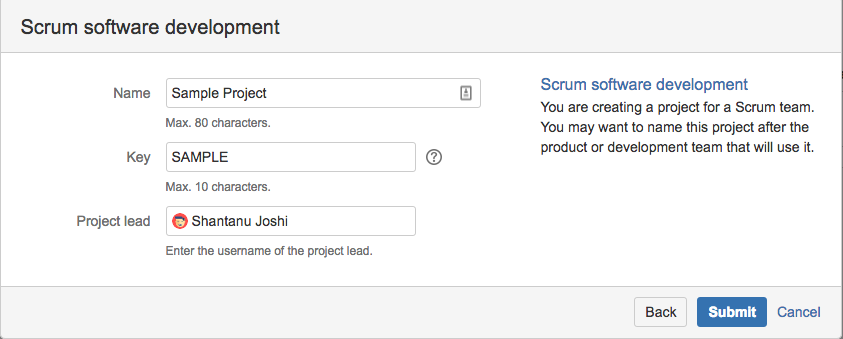
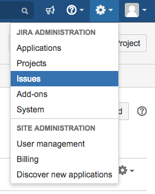
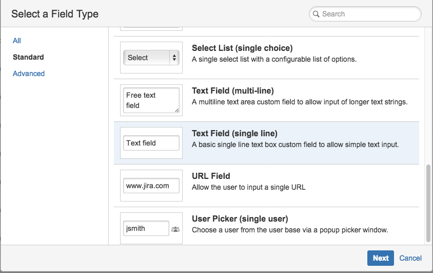

JIRA Setup
==========

This document will guide you through the basic steps to configure your Atlassian JIRA setup to use with the sample code
for consuming webhooks. Note that this configuration may not match with your own usage of JIRA, it is only meant to
demonstrate one particular use case.

To complete the below steps, you will need to login as the admin uesr for your JIRA account.

#### Creating a Project


1. On the Projects screen, click on Create Project.<br>

2. On the Create Project, select Scrum software development, then click Next.<br>

3. Enter a project name, then a project key. The project key will be needed later. You can choose any user as the
Project Lead.<br>


#### Creating Custom Fields

For the sample code provided, you will need to add two custom fields to your JIRA issues. These two fields,
the 'End User Name' and 'Helpshift Ticket', are used to demonstrate how custom values from Helpshift issues
can be mapped to JIRA tickets.

Note: This is optional, and if you don't want to add custom fields to your project, you can skip this step. You will
also need to comment out the relevant code in
<a href="../java/src/main/java/com/helpshift/examples/handlers/JIRAHandler.java" target="_blank">
JIRAHandler.java </a> and
<a href="../python/handlers/jira_handler.py" target="_blank"> jira_handler.py </a>. See the comments in those files for details.

1. Click the gear on the top right, then click on Issues. <br>


2. Select Fields > Custom Fields -> Add Custom Field.
3. Select the "Text Field (single line)" field type, then click on Next.<br>

4. Name the field as User Name. Click on Create to create this custom field.
5. Repeat the above steps, and create another custom field name "Helpshift Ticket", this time choosing "URL Field" as field type.

##### Fetching the Custom Field names
Since we will be setting the field values via the JIRA REST API, we need to retrieve the internal names for these fields, which
are different for each JIRA site. The easiest way to fetch the names of the fields is using the REST API.

From the command line, run the following command, replacing USERNAME and PASSWORD with your JIRA username and password,
and SITENAME with the name of your JIRA site.
 ````
 curl -u USERNAME:PASSWORD https://<SITENAME>.atlassian.net/rest/api/2/issue/createmeta?expand=projects.issuetypes.fields
 ````

 The output will be a JSON map containing all the fields (standard and custom) which can be set using the REST API. Search for the custom
 fields we added above, and note the name of the custom field, which will be different for each JIRA setup. A sample extract is shown below,
 where the name of the field is 'customfield_10120'. You wil need to enter these values into the
 <a href="../java/conf/config.properties" target="_blank"> Java Config file </a> and
 <a href="../python/config.json" target="_blank"> Python Config file </a> files.

 ```
 "customfield_10120": {
               "required": false,
               "schema": {
                 "type": "string",
                 "custom": "com.atlassian.jira.plugin.system.customfieldtypes:url",
                 "customId": 10120
               },
               "name": "Helpshift Ticket",
               "key": "customfield_10120",
               "hasDefaultValue": false,
               "operations": [
                 "set"
               ]
             },
 ```
Refer to this
<a href="https://confluence.atlassian.com/jirakb/how-to-find-id-for-custom-field-s-744522503.html" target="_blank"> document </a>
for alternatives to finds custom fields name.

#### JIRA integration Sample code

1. Java
    * <a href="../java/README.md" target="_blank"> Using Java Sample Code </a>
    * <a href="../java/src/main/java/com/helpshift/examples/handlers/JIRAHandler.java" target="_blank"> JIRAHandler.java </a>
2. Python
    * <a href="../python/README.md" target="_blank"> Using Python Sample Code </a>
    * <a href="../python/handlers/jira_handler.py" target="_blank"> jira_handler.py </a>
