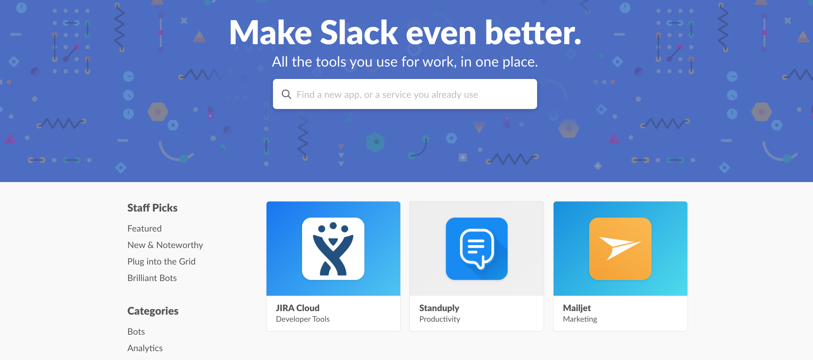
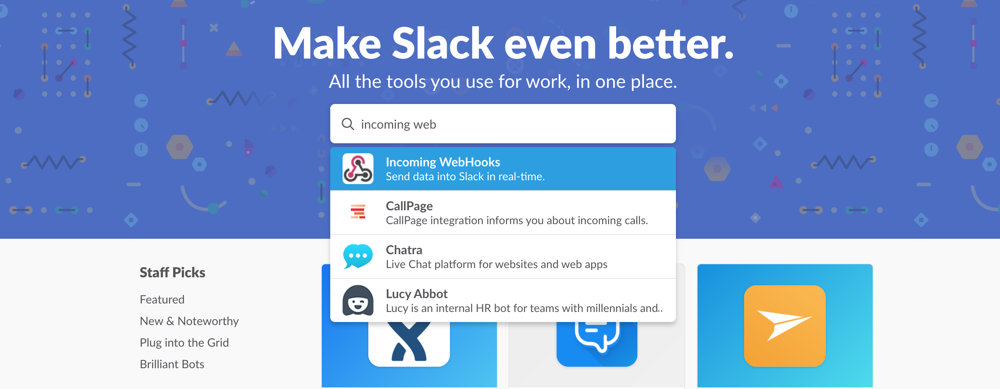
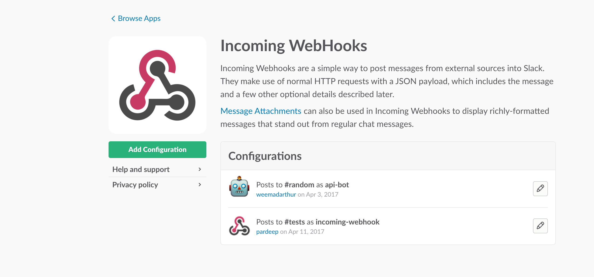
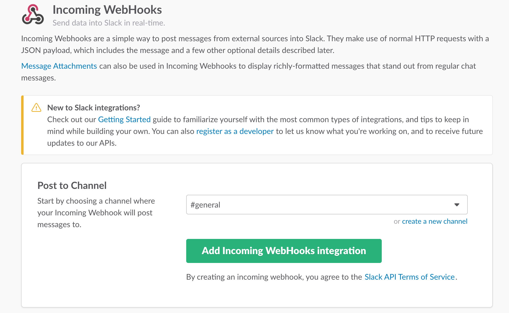
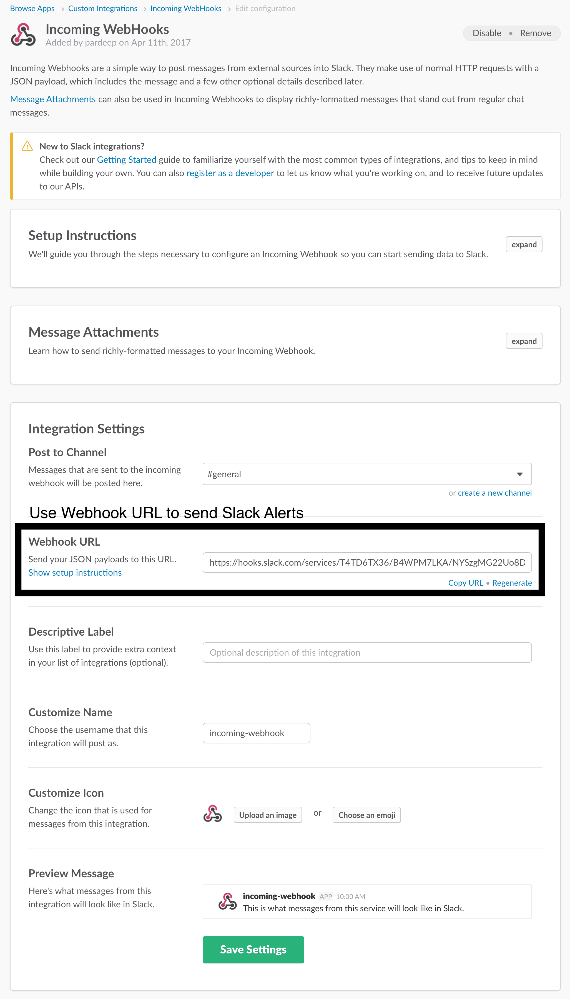

Slack Channel Setup
===================

Use this document to setup your Slack channel to receive alerts via Slack API. You need to login to your Slack app to configure incoming webhooks.

Follow following steps to configure Slack to receive alerts via Slack API.

1. Go to <a href="https://slack-team-name.slack.com/apps" target="_blank">
   https://slack-team-name.slack.com/apps </a>

    

2. Search for incoming webhooks app and click on the incoming webhooks.

    

3. This will take you to incoming webhooks page where you can configure channels to receive alerts via Slack API.

4. Click on Add Configuration.

    

5. Choose a channel where you want to send Slack alerts and click on Add Incoming Webhooks Integration.

    

6. After clicking on Add Incoming Webhooks Integration, you will be given instructions to send Slack alerts via Slack API.

    

7. Click on Save Settings after making your changes.

8. Update the Slack webhook_url in <a href="../java/conf/config.properties" target="_blank"> Java Config file </a>
   and <a href="../python/config.json" target="_blank"> Python Config file </a> with Webhook URL highlighted in instructions.

9. Refer to Slack integration sample code.
    * Java
        * <a href="../java/README.md" target="_blank"> Using Java Sample Code </a>
        * <a href="../java/src/main/java/com/helpshift/examples/handlers/SlackHandler.java" target="_blank"> SlackHandler.java </a>
    * Python
        * <a href="../python/README.md" target="_blank"> Using Python Sample Code </a>
        * <a href="../python/handlers/slack_handler.py" target="_blank"> slack_handler.py </a>
